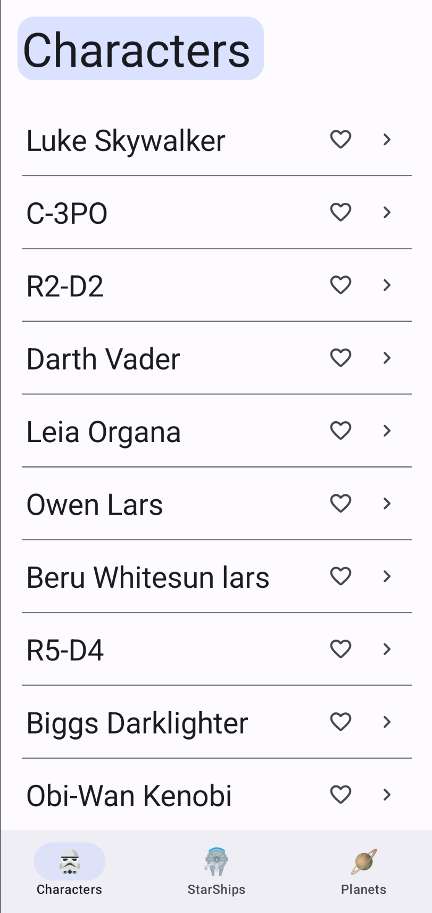

# android_starwars
A reference book for the Star Wars universe using Jetpack Compose and the SWAPI GraphQL endpoint.

**Note**: the [SWAPI endpoint](https://swapi-graphql.netlify.app/graphql) has [known issues](https://github.com/quarkusio/quarkus/issues/45334#issue-2766087594) which leads to a lot of the data (movie count, entity details) not being loaded correctly. A patch for this is since waited for from the author of the SWAPI graphql wrapper

## Setup

1. Clone the project into android studio
2. Resolve dependencies by `Sync Project with Gradle Files` button

